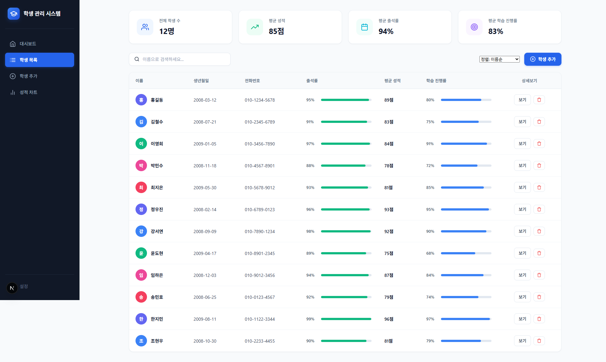
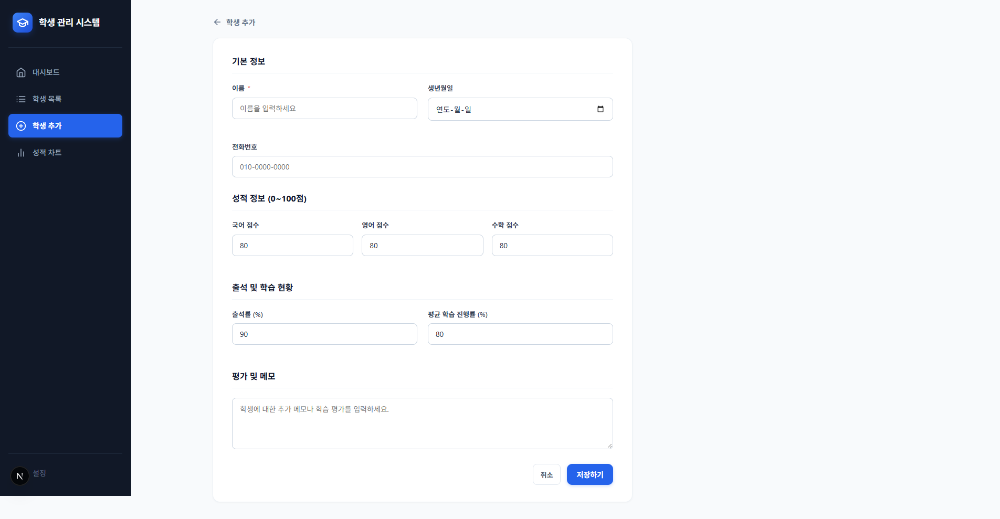
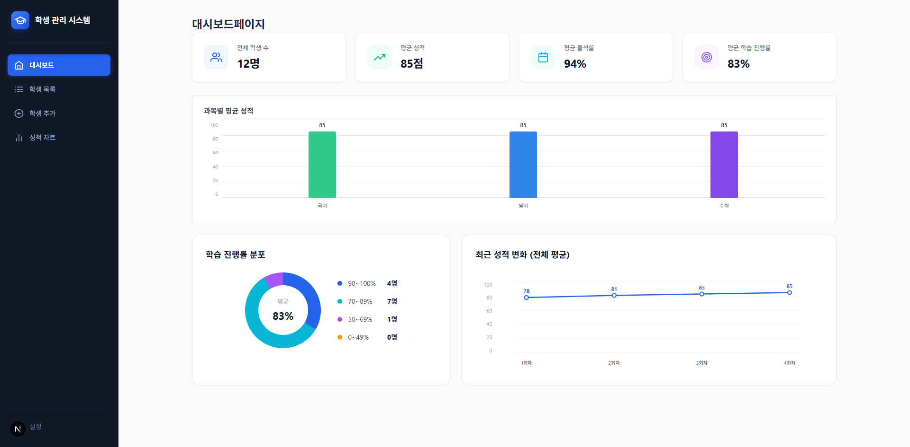

# 학생 관리 시스템

학생 정보를 등록하고 목록을 관리하며, 성적·출석·학습 진행 현황을 시각적으로 확인할 수 있는 Next.js 기반 개인 프로젝트입니다.

- 개발 기간: 2026.09.28 ~ 2026.10.02
- 주요 사용자: 학생별 학업 정보를 관리하는 사용자
- 제작 목적: 학생 정보와 학습 현황을 한곳에서 조회하고 관리할 수 있도록 제작했습니다.

## 주요 기능

- 전체 학생 목록과 학생 수, 평균 성적, 평균 출석률, 평균 학습 진행률을 확인할 수 있습니다.
- 학생 이름으로 검색하고 이름, 성적, 출석률, 학습 진행률 기준으로 정렬할 수 있습니다.
- 학생의 기본 정보, 성적, 출석률, 학습 진행률, 메모를 등록할 수 있습니다.
- 학생 정보를 삭제할 수 있습니다.
- 대시보드에서 학생별 평균 성적과 학습 현황을 확인할 수 있습니다.
- 학생과 과목을 선택해 회차별 시험 성적을 차트로 확인할 수 있습니다.

| 기능 | 주소 | 설명 |
|---|---|---|
| 학생 목록 | `/students` | 학생 목록, 요약 통계, 검색 및 정렬 기능을 제공합니다. |
| 대시보드 | `/dashboard` | 전체 학생의 평균 성적과 학습 현황을 확인합니다. |
| 학생 등록 | `/students/new` | 학생 기본 정보와 학업 정보를 등록합니다. |
| 성적 분석 | `/analytics` | 학생과 과목별 시험 성적 변화를 차트로 확인합니다. |

## 화면 구성

### 학생 목록 화면



학생 목록과 요약 통계를 확인하고, 이름 검색 및 기준별 정렬을 할 수 있습니다.

### 성적 분석 화면

.png)

학생과 과목을 선택해 회차별 성적 변화를 확인합니다.

### 학생 등록 화면



학생의 기본 정보와 과목별 점수, 출석률, 학습 진행률 및 메모를 입력합니다.

### 대시보드 화면



학생 전체의 정보와 분포도, 최근 성적 변화(전체 평균)등을 확인합니다.


## 기술 스택

- Next.js
- React
- JavaScript
- TanStack Query
- Recharts
- JSON Server
- CSS

## 설치 및 실행 방법

### 1. 저장소 복제

```bash
git clone 저장소주소
```

### 2. 프로젝트 폴더로 이동

```bash
cd prontend_project
```

### 3. 패키지 설치

```bash
npm install
```

### 4. JSON Server 실행

학생 데이터 API 서버를 실행합니다.

```bash
npm run server
```

### 5. Next.js 실행

새로운 터미널을 열어 실행합니다.

```bash
npm run dev
```

### 접속 주소

- Next.js: http://localhost:3000
- JSON Server: http://localhost:4000
- 학생 데이터 API: http://localhost:4000/students

## 폴더 구조

```text
src/
├─ api/                 # 학생 데이터 API 요청 함수
│
├─ app/                 # 페이지와 라우팅
│  ├─ analytics/        # 성적 분석 페이지
│  ├─ dashboard/        # 대시보드 페이지
│  └─ students/         # 학생 목록 및 등록 페이지
│
├─ components/
│  ├─ common/           # 공통 UI 컴포넌트(사이드 바) 및 아이콘
│  └─ students/         # 학생 관리 UI 컴포넌트
│
├─ hooks/               # TanStack Query 기반 학생 데이터 훅
└─ styles/              # 전역 스타일 css
layout.js               # 루트 레이아웃
page.js                 # /students 페이지로 바로 이동됨 
db.json                 # JSON Server 학생 데이터
docs/                   # 화면 캡처 이미지
```

## 주요 컴포넌트

| 컴포넌트 | 역할 |
|---|---|
| `StudentTable` | 학생 목록과 학생별 출석률, 성적, 학습 진행률을 표시합니다. |
| `StudentForm` | 학생의 기본 정보와 학업 정보, 메모 등을 입력받는 폼(Form)형식입니다. |
| `StartCard` | 전체 학생 수와 평균 성적·출석률·학습 진행률을 요약합니다. |
| `StudentEverage` | 대시보드의 학생별 평균 성적 및 학습 현황을 표시합니다. |
| `Sidebar` | 대시보드, 학생 목록, 등록, 성적 분석 페이지로 이동하는 메뉴를 제공합니다. |


## 상태 관리

- 학생 데이터 조회와 등록·삭제 후 캐시 갱신은 TanStack Query로 처리합니다.
- 검색어와 정렬 기준 등 화면에서만 사용하는 값은 React `useState`로 관리합니다.
- 학생 데이터는 JSON Server의 `db.json`을 통해 조회하고 변경합니다.

## 트러블슈팅

### TanStack Query에서 404 오류가 에러 상태로 처리되지 않은 문제

#### 문제
학생 데이터를 JSON Server에서 가져오기 위해 TanStack Query를 사용하던 중 API 요청에서 404 오류가 발생했습니다.

처음에는 TanStack Query를 사용하고 있기 때문에 404와 같은 HTTP 오류도 자동으로 `isError` 상태로 처리될 것이라고 생각했습니다.


#### 원인
TanStack Query는 `queryFn`에서 발생한 에러를 감지하여 `isError` 등의 상태를 관리하지만, `fetch`가 반환한 HTTP 응답의 상태 코드까지 자동으로 에러로 판단하지는 않습니다.

`fetch`는 404나 500과 같은 HTTP 오류가 발생하더라도 Response 객체를 반환합니다.


#### 해결
다음과 같이 `response.ok`를 직접 확인했습니다.
```js
// const response = await fetch(url);

// if (!response.ok) {
//     throw new Error("학생 데이터를 불러오지 못했습니다.");
// }

// return response.json();


#### 알게 된 점
TanStack Query는 `fetch`가 반환한 HTTP 응답의 상태코드까지 자동으로 에러로 판단하지 않는다는 것을 알게되었습니다.
따라서 조건문을 통해서 response.ok의 불리언 값을 체크하고 그에 따라 에러 메시지를 만들도록 해야한다는것을 알게되었습니다.


## 프로젝트 회고

이번 프로젝트를 통해서 수업시간에 배운 내용들을 직접 적용해보고, '왜 이렇게 작동하는지' 그 동작 원리에 대해 생각해 볼 수 있는 시간을 가질  수 있어서 좋았습니다. 수업시간과 간단한 코드들을 작성했을 때는 왜 그래야하는지 이해가 잘 되지 않았던 부분들이 직접 코드를 작성하고 기능들과 화면을 구성해보니 이해가 되기 시작했습니다. 또한 무엇이 더 최적의 방법일까 고민하는 시간을 통해 기획과 설게 능력이 성장한것 같습니다. # prontend_project
